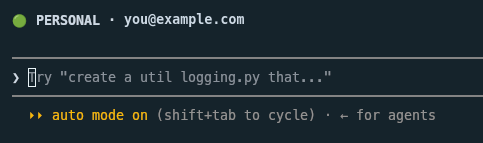
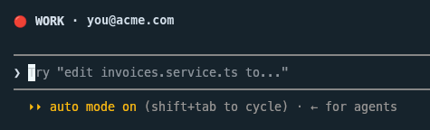
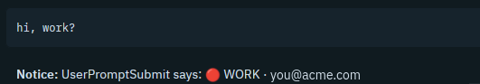
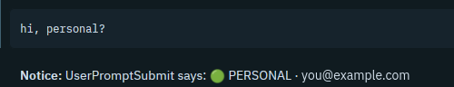
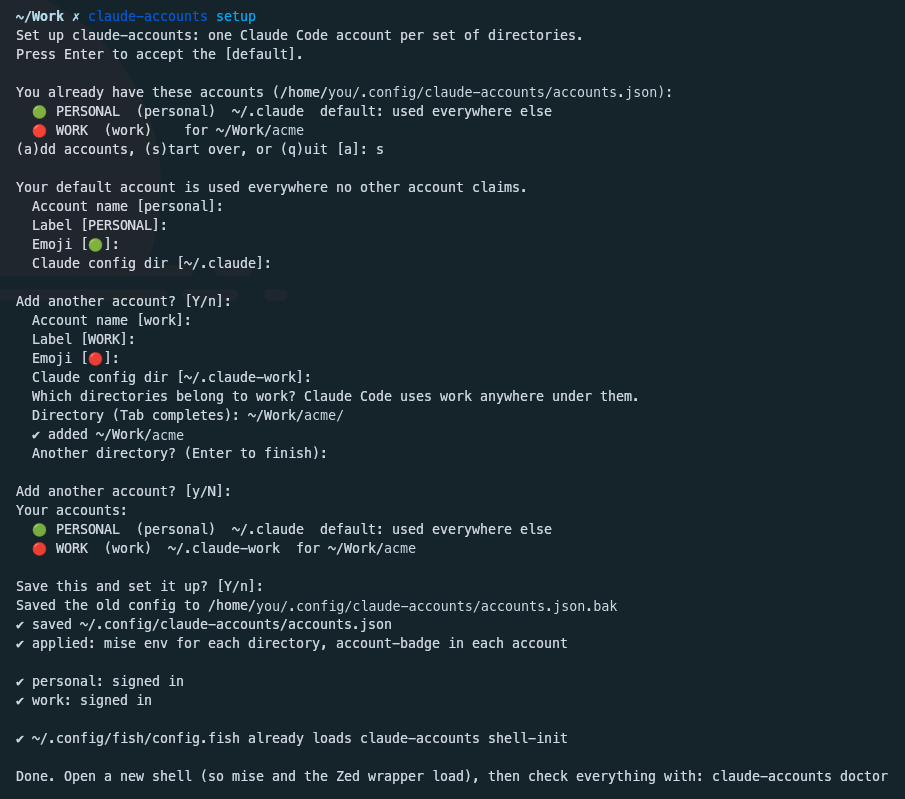
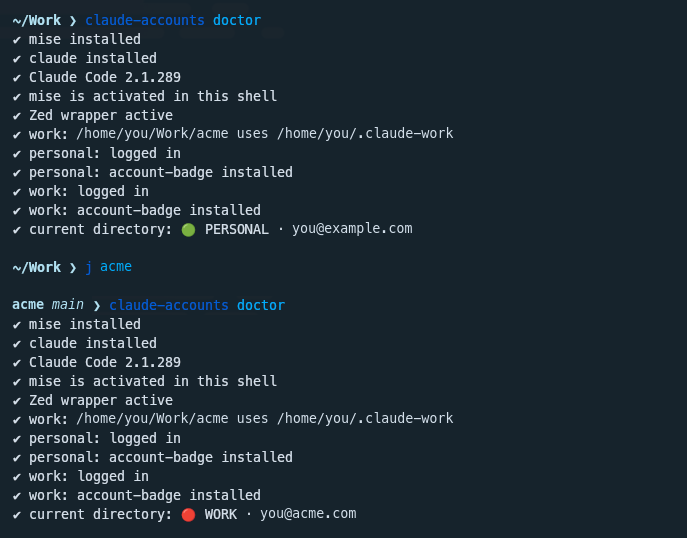

# claude-accounts

`claude-accounts` lets you use multiple Claude subscriptions at the same time.\
This is useful if you want to use a personal and work account at the same time.

It binds specific `claude` accounts to specific directories, so you can have all children of your `work` directory use your work account, for example.

It currently supports switching and showing current account in:

- `claude` (CLI)
- Zed

Other tools may be supported already, but are yet untested. YMMV.

# Screenshots

The CLI shows the badge above the prompt:




Zed shows the badge as a Notice:




## Requirements

- macOS or Linux
- [mise](https://mise.jdx.dev), activated in your shell
- jq
- Claude Code 2.1.289 or later

## Install

Run the installer:

```sh
curl -fsSL https://raw.githubusercontent.com/zdavison/claude-accounts/main/install.sh | sh
```

### Install without the installer

Install the package with mise:

```sh
mise use -g npm:@zdavison/claude-accounts
```

You can also use npm: `npm install -g @zdavison/claude-accounts`. Then run `claude-accounts setup`.

## Setup

Run the setup command to configure `claude-accounts` at any time.

```sh
claude-accounts setup
```

The setup command asks which accounts you want. For each account, it asks for these values:

- the label and the emoji
- the config directory
- the directories that the account owns

To add accounts later, run the setup command again. You can also start again from an empty configuration.



When the setup command is done, open a new shell. Then run `claude-accounts doctor` to check the setup. In a work directory, the doctor command shows the work account. In all other directories, it shows the personal account.



### Set up from a script

To set up from a script, for example a dotfiles install script, use these commands:

```sh
claude-accounts init                                   # personal account in ~/.claude
claude-accounts add work --dir ~/Work/acme --emoji 🔴  # config directory ~/.claude-work
claude-accounts apply
claude-accounts login work
```

If you use Zed, add the Zed wrapper to your shell rc file:

```sh
claude-accounts shell-init fish | source          # fish
eval "$(claude-accounts shell-init bash)"         # bash
eval "$(claude-accounts shell-init zsh)"          # zsh
```

## Uninstall

Run the uninstall command:

```sh
claude-accounts uninstall
```

The uninstall command shows what it removes and asks you to confirm. It removes these items:

- `CLAUDE_CONFIG_DIR` from the `mise.local.toml` file in each directory of an account
- the `account-badge` plugin from each account
- the Zed wrapper from your shell rc file
- the configuration in `~/.config/claude-accounts`

The uninstall command keeps your Claude config directories, with your logins and history. Then it shows the command that removes the `claude-accounts` package.

## How it works

Each account has its own Claude Code config directory. Claude Code reads the config directory from `CLAUDE_CONFIG_DIR`.

The `apply` command writes `CLAUDE_CONFIG_DIR` into a `mise.local.toml` file in each directory of an account. Then mise sets `CLAUDE_CONFIG_DIR` for the CLI. Zed loads the shell environment of each project. Thus mise also sets `CLAUDE_CONFIG_DIR` for Zed.

One Zed process serves all windows. That process keeps the environment from when it started. Thus the Zed wrapper starts Zed without `CLAUDE_CONFIG_DIR`. As a result, the account of one project does not go into other projects.

The `apply` command installs the `account-badge` plugin into each account. The plugin reads the `CLAUDE_CONFIG_DIR` of the session and the email of the signed-in account. Thus the badge always shows the account that the session uses.

The configuration file is `~/.config/claude-accounts/accounts.json`. claude-accounts does not change these files:

- your `statusLine` setting
- your `CLAUDE.md` files
- your `settings.json` files
- a `mise.toml` file in your repository

## Commands

| Command | Description |
|---|---|
| `setup` | Ask for the accounts, then apply them, sign in, and set up the shell rc file |
| `init` | Create the configuration with a personal account, with no questions |
| `add <name> [--dir PATH]… [--label L] [--emoji E] [--config-dir D]` | Add an account |
| `remove <name>` | Remove an account. Its config directory stays on disk. |
| `set <name> label\|emoji\|configDir\|dirs+\|dirs- <value>` | Change an account |
| `apply [--marketplace SRC]` | Apply the configuration. You can run it again safely. |
| `which [DIR] [--json]` | Show the account in use in this directory or in DIR, and the expected account |
| `login <name>` | Sign in to an account |
| `shell-init fish\|bash\|zsh` | Print the Zed wrapper |
| `doctor` | Check the setup and show how to fix problems |
| `uninstall [--yes]` | Undo the setup. Your Claude config directories stay on disk. |

The plugin has one option, `label_replies`. If you set `label_replies`, Claude starts each reply with the account label. The default is off. To set the option, run `/plugin configure account-badge@account-switcher` in Claude Code.

## Limitations

- claude-accounts does not support Windows.
- claude-accounts does not support direnv.
- In the Claude Desktop app, the badge can show `⚠ account unknown`. Plugins in the Desktop app cannot run the script that finds the account.
